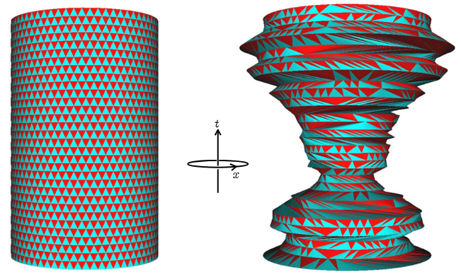
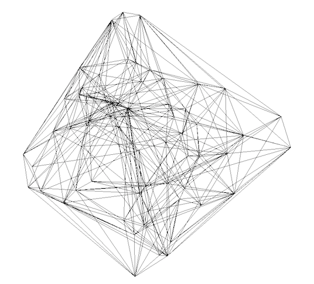
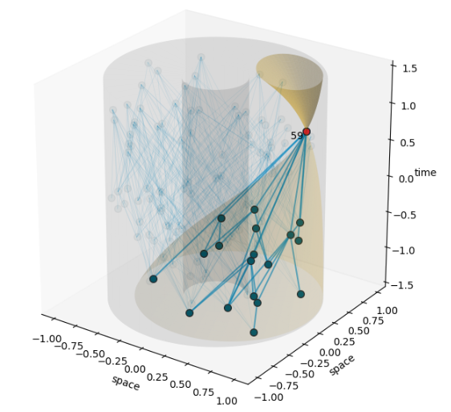

# Quantum-Gravity-with-Python
An aggregation of Python libraries dedicated to approaches to Quantum Gravity and related ideas and tools

Beginning with a homogeneous 1 + 1 dimensional universe (left), large vacuum fluctuations in circumference arise (right). From Israel, Norman S., and John F. Lindner. "Quantum gravity on a laptop: 1+ 1 Dimensional Causal Dynamical Triangulation simulation." Results in Physics 2 (2012): 164-169.

## CDTea: Utilities for studying causal dynamical triangulations in Python

https://pypi.org/project/cdtea/

https://github.com/JWKennington/cdtea

https://science.psu.edu/physics/people/jmk7376

https://igc.psu.edu/people/bio/jmk7376/

## CDT-pluspus: Quantize spacetime on your laptop.

https://github.com/acgetchell/CDT-plusplus

## Graphity: Research in background independent quantum gravity, also known as quantum graphity.

https://pypi.org/project/graphity/

https://github.com/Matthew-McRaven/graphity

https://matthew-mcraven.github.io/

Konopka, Tomasz, Fotini Markopoulou, and Lee Smolin. "Quantum graphity." arXiv preprint hep-th/0611197 (2006). (https://arxiv.org/abs/hep-th/0611197)

Konopka, Tomasz, Fotini Markopoulou, and Simone Severini. "Quantum graphity: a model of emergent locality." Physical Review D 77, no. 10 (2008): 104029. (https://journals.aps.org/prd/abstract/10.1103/PhysRevD.77.104029)

Caravelli, Francesco, and Fotini Markopoulou. "Properties of quantum graphity at low temperature." Physical Review D 84, no. 2 (2011): 024002. (https://journals.aps.org/prd/abstract/10.1103/PhysRevD.84.024002)

Requardt, Manfred, and Saeed Rastgoo. "The structurally dynamic cellular network and quantum graphity approaches to quantum gravity and quantum geometry-a review and comparison." arXiv preprint arXiv:1501.00391 (2015). (https://arxiv.org/abs/1501.00391)

Quach, James Q., Chun-Hsu Su, Andrew M. Martin, and Andrew D. Greentree. "Domain structures in quantum graphity." Physical Review D 86, no. 4 (2012): 044001. (https://journals.aps.org/prd/abstract/10.1103/PhysRevD.86.044001)

## Computational Causal Dynamical Triangulation

Israel, Norman S., and John F. Lindner. "Quantum gravity on a laptop: 1+ 1 Dimensional Causal Dynamical Triangulation simulation." Results in Physics 2 (2012): 164-169.

Rajbhandari, Damodar, and Symbol No. "An open source code for Causal Dynamical Triangulations without preferred foliation in (1+ 1)-dimensions with elementary expositions." (2018).

An Open-Source Approach to Quantum Gravity, https://medium.com/read-write-participate/an-open-source-approach-to-quantum-gravity-2faafbcadeec

## String Theory and Machine Learning

New Solutions for Quantum Gravity with TensorFlow. https://ai.googleblog.com/2019/11/new-solutions-for-quantum-gravity-with.html

https://github.com/google-research/google-research/tree/master/m_theory

https://pypi.org/project/tensorflow-quantum/

He, Yang-Hui. "Deep-learning the landscape." arXiv preprint arXiv:1706.02714 (2017). (https://arxiv.org/abs/1706.02714)

## Causal Sets

* Python Causets: 

https://github.com/c-minz/Python-causets

https://github.com/c-minz/Python-causets-examples. The files operators_causal.py and pastinf_sizes.py are scripts that produce small data sets for plots and a data table given in my PhD thesis [1] and the publication [2].

[1] C. Minz, Algebraic Field Theory on Causal Sets: Local Structures and Quantization Methods, PhD thesis, University of York (2021).

[2] C. J. Fewster, E. Hawkins, C. Minz, and K. Rejzner, Local structure of sprinkled causal sets, Phys. Rev. D 103, 086020 (2021). https://doi.org/10.1103/PhysRevD.103.086020

* Causal Sets Explorer 

Causal sets explorer will eventually perform graph-theoretic calculations on Causal sets.It's also a test-bed for CDT-plusplus.
https://github.com/acgetchell/causal-sets-explorer

The causal set approach to quantum gravity: https://arxiv.org/abs/1903.11544

## Deep Learning as Spacetime

Deep Learning and Quantum Gravity, https://www.youtube.com/watch?v=vnMC-InCS1Y

Koji Hashimoto, Osaka University: http://www.physicsmeetsml.org/posts/sem_2020_06_17/

Gan, Wen-Cong, and Fu-Wen Shu. "Holography as deep learning." International Journal of Modern Physics D 26, no. 12 (2017): 1743020. (https://www.worldscientific.com/doi/abs/10.1142/S0218271817430209)

Hashimoto, Koji, Sotaro Sugishita, Akinori Tanaka, and Akio Tomiya. "Deep learning and the AdS/CFT correspondence." Physical Review D 98, no. 4 (2018): 046019. (https://journals.aps.org/prd/abstract/10.1103/PhysRevD.98.046019)

## Misc

Modeling a Theory of Gravity Using Machine Learning, https://www.youtube.com/watch?v=hij6tdAkb3M

Explainable deep learning models for cosmological structure formation, https://www.youtube.com/watch?v=GMXxbmXapsw

Vanchurin, Vitaly. "Towards a theory of quantum gravity from neural networks." Entropy 24, no. 1 (2021): 7. (https://www.mdpi.com/1099-4300/24/1/7)

Physics Meets ML: https://www.youtube.com/@physicsmeetsml6979

Will quantum theory and relativity meet at the nanoscale? https://kavlifoundation.org/news/will-quantum-theory-and-relativity-meet-at-the-nanoscale

